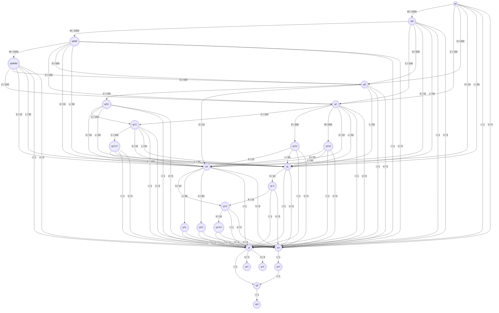

```mermaid
flowchart TD

    %% ESTADOS
    q0((q0))
    %% milhares
    qM(((qM)))
    qMM(((qMM)))
    qMMM(((qMMM)))
    %% centenas
    qC(((qC)))
    qCC(((qCC)))
    qCCC(((qCCC)))
    qCD(((qCD)))
    qCM(((qCM)))
    qD(((qD)))
    qDC(((qDC)))
    %% dezenas
    qX(((qX)))
    qXX(((qXX)))
    qXXX(((qXXX)))
    qXL(((qXL)))
    qXC(((qXC)))
    qL(((qL)))
    qLX(((qLX)))
    %% unidades
    qI(((qI)))
    qII(((qII)))
    qIII(((qIII)))
    qIV(((qIV)))
    qIX(((qIX)))
    qV(((qV)))
    qVI(((qVI))) 

    %% TRANSIÇÕES
    q0 --> |"M / 1000"|qM
    q0 --> |"C / 100"|qC
    q0 --> |"D / 500"|qD
    q0 --> |"X / 10"|qX
    q0 --> |"L / 50"|qL
    q0 --> |"I / 1"|qI
    q0 --> |"V / 5"|qV

    %% milhares
    qM --> |"M / 1000"|qMM
    qM --> |"C / 100"|qC
    qM --> |"D / 500"|qD
    qM --> |"X / 10"|qX
    qM --> |"L / 50"|qL
    qM --> |"I / 1"|qI
    qM --> |"V / 5"|qV

    qMM --> |"M / 1000"|qMMM
    qMM --> |"C / 100"|qC
    qMM --> |"D / 500"|qD
    qMM --> |"X / 10"|qX
    qMM --> |"L / 50"|qL
    qMM --> |"I / 1"|qI
    qMM --> |"V / 5"|qV

    qMMM --> |"C / 100"|qC
    qMMM --> |"D / 500"|qD
    qMMM --> |"X / 10"|qX
    qMMM --> |"L / 50"|qL
    qMMM --> |"I / 1"|qI
    qMMM --> |"V / 5"|qV

    %% centenas
    qC --> |"C / 100"|qCC
    qC --> |"D / 300"|qCD
    qC --> |"M / 800"|qCM
    qC --> |"X / 10"|qX
    qC --> |"L / 50"|qL
    qC --> |"I / 1"|qI
    qC --> |"V / 5"|qV

    qCC --> |"C / 100"|qCCC
    qCC --> |"X / 10"|qX
    qCC --> |"L / 50"|qL
    qCC --> |"I / 1"|qI
    qCC --> |"V / 5"|qV

    qCCC --> |"X / 100"|qX
    qCCC --> |"L / 50"|qL
    qCCC --> |"I / 1"|qI
    qCCC --> |"V / 5"|qV

    qCD --> |"X / 10"|qX
    qCD --> |"L / 50"|qL
    qCD --> |"I / 1"|qI
    qCD --> |"V / 5"|qV

    qCM --> |"X / 10"|qX
    qCM --> |"L / 50"|qL
    qCM --> |"I / 1"|qI
    qCM --> |"V / 5"|qV

    qD --> |"C / 100"|qDC
    qD --> |"X / 10"|qX
    qD --> |"L / 50"|qL
    qD --> |"I / 1"|qI
    qD --> |"V / 5"|qV

    qDC --> |"C / 100"|qCC
    qDC --> |"X / 10"|qX
    qDC --> |"L / 50"|qL
    qDC --> |"I / 1"|qI
    qDC --> |"V / 5"|qV

    %% dezenas
    qX --> |"X / 10"|qXX
    qX --> |"L / 30"|qXL
    qX --> |"C / 80"|qXC
    qX --> |"I / 1"|qI
    qX --> |"V / 5"|qV

    qXX --> |"X / 10"|qXXX
    qXX --> |"I / 1"|qI
    qXX --> |"V / 5"|qV

    qXXX --> |"I / 1"|qI
    qXXX --> |"V / 5"|qV

    qXL --> |"I / 1"|qI
    qXL --> |"V / 5"|qV

    qXC --> |"I / 1"|qI
    qXC --> |"V / 5"|qV

    qL --> |"X / 10"|qLX
    qL --> |"I / 1"|qI
    qL --> |"V / 5"|qV

    qLX --> |"X / 10"|qXX
    qLX --> |"I / 1"|qI
    qLX --> |"V / 5"|qV

    %% unidades
    qI -->|"I / 1"|qII
    qI -->|"V / 3"|qIV
    qI -->|"X / 8"|qIX

    qII -->|"I / 1"|qIII

    qV -->|"I / 1"|qVI

    qVI -->|"I / 1"|qII
```
