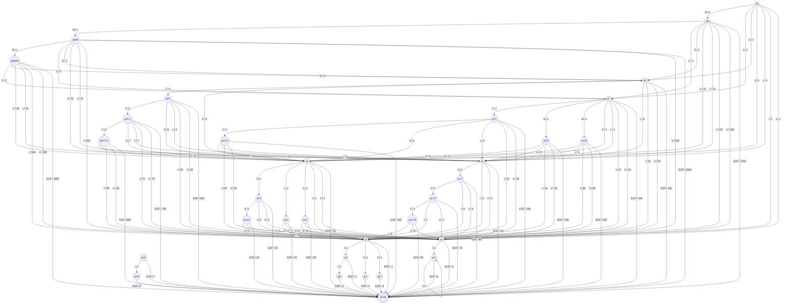

```mermaid
flowchart TD
    %%ESTADOS
    q0((q0))
    qFIM(((qFIM)))
    %%milhares
    qM((qM))
    qMM((qMM))
    qMMM((qMMM))
    %%centenas
    qC((qC))
    qCC((qCC))
    qCCC((qCCC))
    qCD((qCD))
    qCM((qCM))
    qD((qD))
    qDC((qDC))
    qDCC((qDCC))
    qDCCC((qDCCC))
    %%dezenas
    qX((qX))
    qXX((qXX))
    qXXX((qXXX))
    qXL((qXL))
    qXC((qXC))
    qL((qL))
    qLX((qLX))
    qLXX((qLXX))
    qLXXX((qLXXX))
    %%unidades
    qI((qI))
    qII((qII))
    qIII((qIII))
    qIV((qIV))
    qIX((qIX))
    qV((qV))
    qVI((qVI))
    qVII((qVII))
    qVIII((qVIII))
    
    %%TRANSIÇÕES
    
    q0 --> |M / ε|qM
    q0 --> |C / ε|qC
    q0 --> |D / ε|qD
    q0 --> |X / ε|qX
    q0 --> |L / ε|qL
    q0 --> |I / ε|qI
    q0 --> |V / ε|qV

    %% milhares
    qM --> |M / ε|qMM
    qM --> |C / 1|qC
    qM --> |D / 1|qD
    qM --> |X / 10|qX
    qM --> |L / 10|qL
    qM --> |I / 100|qI
    qM --> |V / 100|qV

    qMM --> |M / ε|qMMM
    qMM --> |C / 2|qC
    qMM --> |D / 2|qD
    qMM --> |X / 20|qX
    qMM --> |L / 20|qL
    qMM --> |I / 200|qI
    qMM --> |V / 200|qV

    qMMM --> |C / 3|qC
    qMMM --> |D / 3|qD
    qMMM --> |X / 30|qX
    qMMM --> |L / 30|qL
    qMMM --> |I / 300|qI
    qMMM --> |V / 300|qV

    %% centenas
    qC --> |C / ε|qCC
    qC --> |D / ε|qCD
    qC --> |M / ε|qCM
    qC --> |X / 1|qX
    qC --> |L / 1|qL
    qC --> |I / 10|qI
    qC --> |V / 10|qV

    qCC --> |C / ε|qCCC
    qCC --> |X / 2|qX
    qCC --> |L / 2|qL
    qCC --> |I / 20|qI
    qCC --> |V / 20|qV

    qCCC --> |X / 3|qX
    qCCC --> |L / 3|qL
    qCCC --> |I / 30|qI
    qCCC --> |V / 30|qV

    qCD --> |X / 4|qX
    qCD --> |L / 4|qL
    qCD --> |I / 40|qI
    qCD --> |V / 40|qV

    qCM --> |X / 9|qX
    qCM --> |L / 9|qL
    qCM --> |I / 90|qI
    qCM --> |V / 90|qV

    qD --> |C / ε|qDC
    qD --> |X / 5|qX
    qD --> |L / 5|qL
    qD --> |I / 50|qI
    qD --> |V / 50|qV

    qDC --> |C / ε|qDCC 
    qDC --> |X / 6|qX
    qDC --> |L / 6|qL
    qDC --> |I / 60|qI
    qDC --> |V / 60|qV

    qDCC --> |C / ε|qDCCC
    qDCC --> |X / 7|qX
    qDCC --> |L / 7|qL
    qDCC --> |I / 70|qI
    qDCC --> |V / 70|qV

    qDCCC --> |X / 8|qX
    qDCCC --> |L / 8|qL
    qDCCC --> |I / 80|qI
    qDCCC --> |V / 80|qV

    qX --> |X / ε|qXX
    qX --> |L / ε|qXL
    qX --> |C / ε|qXC
    qX --> |I / 1|qI
    qX --> |V / 1|qV

    qXX --> |X / ε|qXXX
    qXX --> |I / 2|qI
    qXX --> |V / 2|qV

    qXXX --> |I / 3|qI
    qXXX --> |V / 3|qV

    qXL --> |I / 4|qI
    qXL --> |V / 4|qV

    qXC --> |I / 9|qI
    qXC --> |V / 9|qV

    qL --> |X / ε|qLX
    qL --> |I / 5|qI
    qL --> |V / 5|qV

    qLX --> |X / ε|qLXX
    qLX --> |I / 6|qI
    qLX --> |V / 6|qV

    qLXX --> |X / ε|qLXXX
    qLXX--> |I / 7|qI
    qLXX --> |V / 7|qV

    qLXXX--> |I / 8|qI
    qLXXX --> |V / 8|qV

    %% unidade
    qI -->|I / ε|qII
    qI -->|V / ε|qIV
    qI -->|X / ε|qIX

    qII -->|I / ε|qIII

    qV -->|I / ε|qVI

    qVI -->|I / ε|qVI

    qVII --> |I / ε|qVIII

    %% ACEITAÇÃO
    qM --> |EOF / 1000|qFIM
    qMM --> |EOF / 2000|qFIM
    qMMM --> |EOF / 3000|qFIM
    qC --> |EOF / 100|qFIM
    qCC --> |EOF / 200|qFIM
    qCCC --> |EOF / 300|qFIM
    qCD --> |EOF / 400|qFIM
    qCM --> |EOF / 900|qFIM
    qD --> |EOF / 500|qFIM
    qDC --> |EOF / 600|qFIM
    qDCC --> |EOF / 700|qFIM
    qDCCC --> |EOF / 800|qFIM
    qX --> |EOF / 10|qFIM
    qXX --> |EOF / 20|qFIM
    qXXX --> |EOF / 30|qFIM
    qXL --> |EOF / 40|qFIM
    qXC --> |EOF / 90|qFIM
    qL --> |EOF / 50|qFIM
    qLX --> |EOF / 60|qFIM
    qLXX --> |EOF / 70|qFIM
    qLXXX --> |EOF / 80|qFIM
    qI --> |EOF / 1|qFIM
    qII --> |EOF / 2|qFIM
    qIII --> |EOF / 3|qFIM
    qIV --> |EOF / 4|qFIM
    qIX --> |EOF / 9|qFIM
    qV --> |EOF / 5|qFIM
    qVI --> |EOF / 6|qFIM
    qVII --> |EOF / 7|qFIM
    qVIII --> |EOF / 8|qFIM 
```
